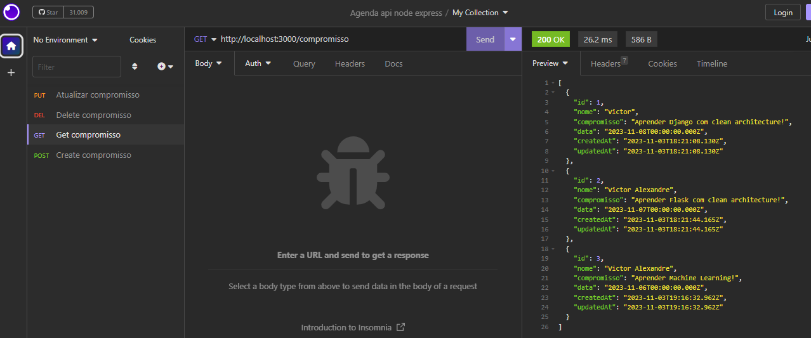

# Api-agenda-node-express
Api de uma agenda de compromissos em node, express, prisma e clean architecture.

## Para criar o banco de dados é necessário migrar
```
npx prisma init
```
```
npx prisma migrate dev <nome_banco>
```

## Tecnologias utilizadas

<ul>
  <li>Javascript</li>
  <li>Node</li>
  <li>Express</li>
  <li>Prisma</li>
  <li>Mysql</li>
  <li>Clean Architecture</li>
</ul>

## Screenshots





